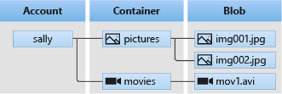
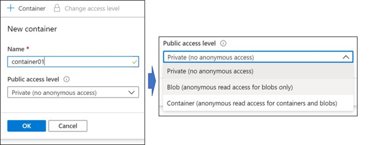

# Blob storage

## What's blob storage?
Azure blobe storage is the object storage solution of Microsoft Azure, which optimized for storing unstructured data. Users or client applications can access objects in blob storage via HTTP/HTTPS, from anywhere in the world. The Objects are accessible via the Azure Storage REST API, Azure PowerShell, Azure CLI, or an Azure Storage client library (.NET, Java, Python, Node.js, etc.).

Blob storage is designed for:
- Images or documents to a browser
- Storing files for distributed access
- Data for backup and restore, disaster recovery, archiving
- Writing to log files
- Video and audio files
- Supports also azure Data Lake Gen2

---

## Storage Account types
|    Account types            |      Supported storage services                         |
|           :---              |     :---                                                |
| Standard general purpose v2 | Blob (incl. Data Lake Gen2), Queue, Table, Disks, Files |
| Premium block blobs         | Blobs only                                              |
| Premium page blobs          | Page blobs only                                         |
| Premium file shares         | Azure Files                                             |

---

## Blob storage access tiers
- **Hot:**
  - Optimized for frequent access data
  - Highest storage costs, but the lowest access costs
  - Default tier
- **Cool:**
  - Optimized for infrequently accessed data
  - Lower storage cost, but highest access costs
  - Stored at least 30 days
- **Archive:**
  - Optimized for several hours retrieval latency
  - Most cost-effective storage cost, but most expensive for accessing data
  - Stored at least 180 days

---

## Blob storage resources
- **Storage Account:** Top level of all storage services. Storage  name e.g. _mystorageaccount007_ (must be globally unique!)
- **Container:** Similar to a directory on file system. A Storage Account have unlimited containers and a container can have unlimited blobs.
- **Blob:** Single file e.g. text, video, etc.

**Note:** Public access level specifies whether data in the container may be accessed publicly. By default, container data is private to the account owner.

---

## Blob life cycle management
Blob storage offers policies for diffrent scenarios and it's available for general-purpose v2 and all blob storage types.
With Policies for blobs you can configure rules to transit the blobs from one access tier to another one (e.g. hot --> cool) to optimize performance and costs or delete blobs after specefic days.

---

## Demos
Look at to the [Bicep](Bicep/) and [Terraform](Terraform/) directories.

